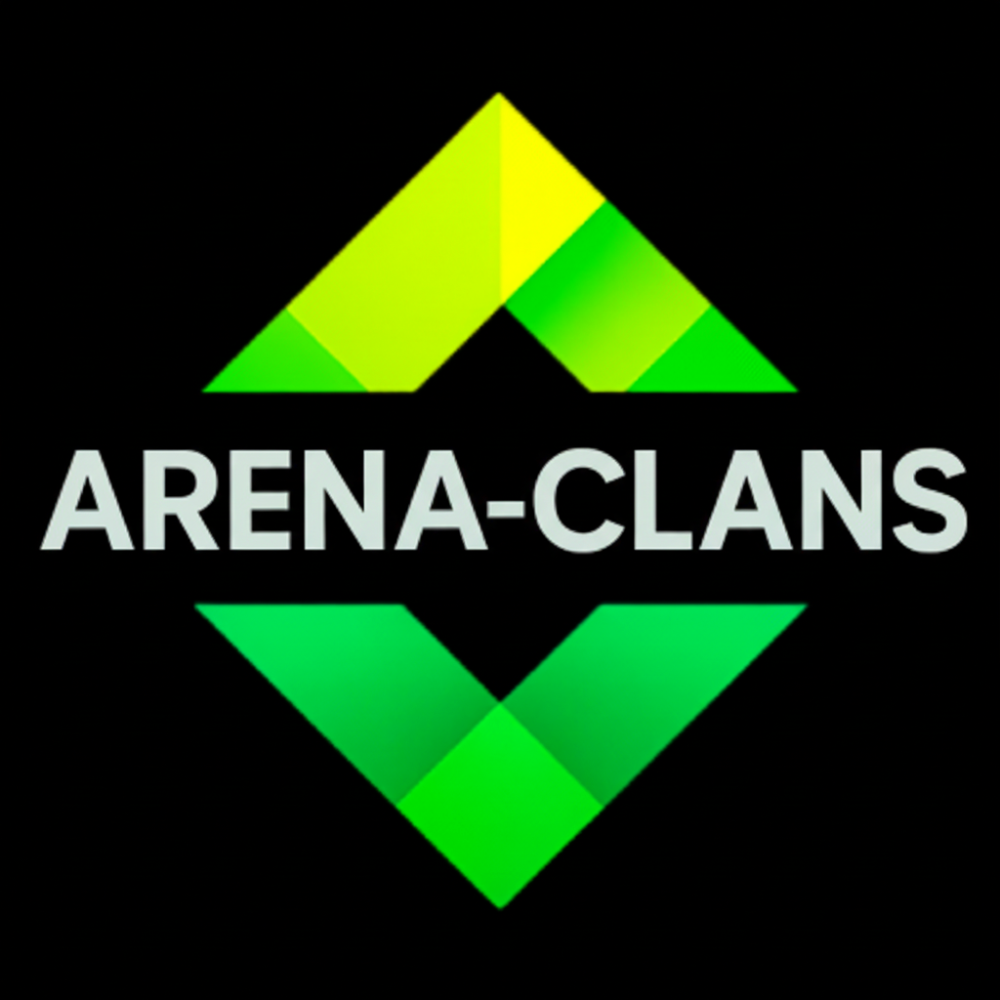

<div align="center">



# 🎮 Arena Clans

Plataforma para equipes competitivas encontrarem **scrims**, se conectarem e avaliarem adversários.

</div>

---

## 📌 Sobre o projeto

**Arena Clans** é uma plataforma web para jogadores competitivos organizarem partidas entre equipes (scrims).

O objetivo é facilitar a conexão entre times, permitindo:

- criação de perfis de equipe
- busca por times de regiões específicas
- comunicação entre equipes
- avaliações de comportamento após partidas

O projeto foi desenvolvido inicialmente como experimento de arquitetura frontend e está evoluindo para um **MVP completo com banco de dados e autenticação real**.

---

## 🚀 Tecnologias utilizadas

- **Next.js (App Router)**
- **React**
- **TypeScript**
- **TailwindCSS**
- **Node.js**

Em desenvolvimento:

- **Supabase** (banco de dados + autenticação)

---

## 🧠 Funcionalidades atuais

✔ Cadastro de usuário  
✔ Criação de equipe  
✔ Perfil de equipe  
✔ Busca de equipes por região  
✔ Sistema de mensagens entre times  
✔ Sistema de avaliações entre equipes  
✔ Dashboard da equipe  

---

## 📂 Estrutura do projeto


app/
components/
services/
types.ts


### Principais pastas

**app/**  
Rotas do Next.js utilizando App Router.

**components/**  
Componentes reutilizáveis da interface.

**services/**  
Camada de acesso a dados (simulação de banco atualmente).

**types.ts**  
Modelos de dados da aplicação.

---

## 💻 Rodando o projeto localmente

### 1️⃣ Clone o repositório

```bash
git clone https://github.com/LypE-X/Arena-Clans-official.git
2️⃣ Entre na pasta do projeto
cd Arena-Clans-official
3️⃣ Instale as dependências
npm install
4️⃣ Rode o servidor de desenvolvimento
npm run dev

A aplicação estará disponível em:

http://localhost:3000
📦 Build de produção

Para testar se o projeto está pronto para produção:

npm run build
🗺 Roadmap do projeto

Próximos passos planejados:

integração com Supabase

autenticação real

chat em tempo real

sistema de ranking

sistema de torneios

sistema de agendamento de partida

👨‍💻 Autor

Felipe Colombo

GitHub:
https://github.com/LypE-X

📄 Licença

Este projeto está em desenvolvimento e atualmente é utilizado para fins educacionais e experimentação de arquitetura web.